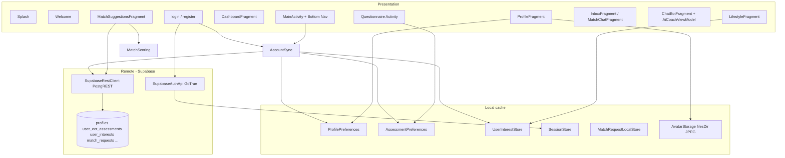

# MatchMind / MAD Project — Architecture Report

Summarized view of the **MAD-Project-NIBM** Android codebase: structure, data flow, and external systems.

---

## 1. Purpose & product shape

The app implements a **relationship-matching journey** (working name *MatchMind* in SQL/docs): onboarding, profile, ECR-RS–style assessment, interest vectors, rule-based **top-5 match suggestions**, optional **match requests** toward Supabase, inbox/chat UI scaffolding, and an **AI coach** chat (local ViewModel + repository pattern).

---

## 2. Technology stack

| Layer | Choice |
|--------|--------|
| Platform | Android (Java), `minSdk` 24, `targetSdk` / compile 36 |
| UI | XML layouts, Material Components, `BottomNavigationView`, `Fragment` per tab |
| Networking | OkHttp 4.x → **Supabase** REST (PostgREST) + GoTrue-style auth endpoints |
| Images | Glide (remote URLs + local profile file) |
| Async | `ExecutorService` on feature screens; `AccountSync` uses a dedicated single-thread pool |
| Local state | `SharedPreferences` (multiple domain-specific files) |
| Build | Gradle Kotlin DSL (`app/build.gradle.kts`), `BuildConfig` for Supabase URL/anon key from `local.properties` |

---

## 3. Repository layout

```
MAD-Project-NIBM/
├── app/                          # Android application module
│   └── src/main/
│       ├── java/com/mad/cw/      # Feature-first packages (see §5)
│       │   ├── welcome/          # Splash + welcome entry
│       │   ├── auth/             # Login/register + auth validation
│       │   ├── shell/            # Main shell + dashboard + account sync
│       │   ├── profile/          # Profile editing, avatar, profile prefs
│       │   ├── assessment/       # Questionnaire + ECR scoring/prefs
│       │   ├── interests/        # Lifestyle interests + taxonomy/store
│       │   ├── matching/         # Top-5 matching + request UX
│       │   ├── inbox/            # Inbox + conversation previews/chat UI
│       │   ├── chat/             # AI coach chat domain
│       │   └── supabase/         # Backend integration layer
│       ├── res/                  # Layouts, drawables, strings, themes
│       └── AndroidManifest.xml
├── sql/                          # Supabase SQL scripts & run guide
├── Model/                        # ML / notebook assets (training pipeline; not wired to app runtime)
├── gradle/                       # Version catalogs / wrappers
├── local.properties              # Gitignored: supabase.url, supabase.anon.key
└── ARCHITECTURE.md               # This file
```

---

## 4. High-level architecture



**Pattern:** There is **no single Repository abstraction** for the whole app; instead **feature-specific** helpers (`ProfileRemoteRepository`, `EcrAssessmentRepository`, etc.) sit beside UI. **AccountSync** is the cross-cutting **rehydration** step after login or cold start.

---

## 5. Package map (`com.mad.cw`)

| Area | Types (representative) | Role |
|------|-------------------------|------|
| **`welcome`** | `Splash`, `Welcome` | Cold start; route to shell when session exists |
| **`auth`** | `login`, `register`, `AuthValidation` | Sign in/up and input validation |
| **`shell`** | `MainActivity`, `DashboardFragment`, `AccountSync` | App shell, tab navigation, and local rehydration from server |
| **`profile`** | `ProfileFragment`, `ProfilePreferences`, `ProfileFormValidator`, `GenderOptions`, `LocationOccupationOptions`, `AvatarStorage`, `ProfileImageLoader`, `AppSignOut` | Profile edit/display, avatar handling, and sign-out cleanup |
| **`assessment`** | `Questionnaire`, `EcrRsScoring`, `AssessmentPreferences` | ECR-RS capture, scoring, and local persistence |
| **`interests`** | `LifestyleFragment`, `InterestTaxonomy`, `UserInterestStore` | Interest category/tag modeling and local lifestyle state |
| **`matching`** | `MatchScoring`, `MatchSuggestion`, `MatchSuggestionsFragment`, `MatchSuggestionsAdapter`, `MatchRequestLocalStore`, `UuidValidation` | Top-5 match generation and request UX constraints |
| **`inbox`** | `InboxFragment`, `ConversationAdapter`, `ConversationPreview`, `MatchChatFragment` | Conversation list and mock chat UI |
| **`chat`** | `ChatBotFragment`, `AiCoachViewModel`, `AiCoachRepository`, `ChatMessage`, `ChatMessageAdapter` | AI coach chat session state and rendering |
| **`supabase.core`** | `SessionStore`, `SupabaseRestClient`, `SupabaseUrls`, `PostgrestError` | Shared backend plumbing, auth headers, URL builders, error parsing |
| **`supabase.auth`** | `SupabaseAuthApi` | GoTrue authentication API |
| **`supabase.repositories`** | `ProfileRemoteRepository`, `ProfileRecord`, `EcrAssessmentRepository`, `UserInterestsRepository`, `MatchRequestRepository` | Table/domain-oriented backend CRUD |

---

## 6. Navigation & activities

| Activity | Role |
|----------|------|
| `welcome.Splash` | Delayed route: logged in → `shell.MainActivity`, else `welcome.Welcome` |
| `welcome.Welcome` | Login / Register entry |
| `login` / `register` | Auth; on success → `MainActivity` (register seeds profile + sync) |
| `shell.MainActivity` | Single-activity shell; swaps **Fragments** in `R.id.fragment_container` |
| `assessment.Questionnaire` | Full-screen ECR flow (outside bottom nav) |

**Back stack:** Some flows (`MatchSuggestionsFragment`, `LifestyleFragment`, chat) use `FragmentTransaction.addToBackStack`; tab switches in `MainActivity` **pop** the back stack for a clean tab experience.

---

## 7. Data architecture

### 7.1 Remote (Supabase)

- **Auth:** JWT stored in `SessionStore` (access + refresh + expiry + `user_id`). OkHttp interceptor attaches **Bearer** user JWT when present, else anon key for pre-login calls.
- **PostgREST:** Typed URLs via `SupabaseRestClient.tableUrl("profiles")` etc.
- **RLS:** Assumed on all user tables; client uses anon key + user JWT only.
- **Core tables** (see `sql/supabase_initial_schema.sql`): `profiles`, `user_ecr_assessments`, `user_interests`, `match_suggestion_batches`, `match_requests`, `relationships`, … Incremental migrations in `sql/*.sql` (e.g. `location`, `occupation`, `avatar_url`).

### 7.2 Local cache (SharedPreferences)

| Store | Keys / purpose |
|-------|----------------|
| `ProfilePreferences` | Mirror of editable profile fields + `avatar_url` |
| `AssessmentPreferences` | ECR completion flag, raw answers CSV, anxiety/avoidance means |
| `UserInterestStore` | Per-category JSON arrays + location + occupation |
| `SessionStore` | Supabase session |
| `MatchRequestLocalStore` | Single pending outbound request id (demo / UX mirror) |
| `UserInterestStore` / interest prefs | Separate file name `user_interests` |

**Design choice:** The app treats **Supabase as source of truth** after login; **`AccountSync.syncFromServer`** pulls profile + latest ECR + `user_interests` into prefs so reinstall / clear-data still recovers state.

### 7.3 Files on disk

- **`AvatarStorage`:** `profile_avatar.jpg` under `filesDir` for the current user’s picked photo (may exist without a public `avatar_url`).

---

## 8. Feature-specific flows (concise)

1. **Register / Login** → `SessionStore.saveSession` → **`AccountSync.syncFromServer`** (blocking on login thread before leaving `login`).
2. **MainActivity** cold start → **`AccountSync.refreshLocalFromServerAsync`** when session exists.
3. **Dashboard `onResume`** → same async refresh + UI refresh for journey %.
4. **Profile save** → `ProfileRemoteRepository.saveMyProfileForm` (PATCH/POST upsert with column fallbacks for older DBs).
5. **Lifestyle save** → `UserInterestStore` + `UserInterestsRepository.upsertFromLocal`.
6. **ECR submit** → local prefs + `EcrAssessmentRepository.insertAssessment`.
7. **Matches** → `MatchScoring.computeTopMatches` (demo pool); **Send request** → UUID → `MatchRequestRepository.insertPending`; non-UUID → local store only.
8. **Logout** → `AppSignOut`: clears session, profile prefs, interests, assessment, match-request local, avatar file.

---

## 9. UI / UX conventions

- **Material** pink accent (`#E91E63`) on primary actions; outlined secondary buttons.
- **Profile editor** card can start collapsed; expands when data exists or user taps “Edit preferences”.
- **Date of birth:** Display normalized to `MM/dd/yyyy`; parsing accepts **ISO `yyyy-MM-dd`** from DB.
- **Location / occupation:** Canonical lists in `LocationOccupationOptions`; display falls back to raw server text if not in list (legacy data).

---

## 10. Configuration & security notes

- **`local.properties`** (not committed): `supabase.url`, `supabase.anon.key` injected into `BuildConfig`.
- **Secrets:** Anon key is public by design; **RLS** must protect rows. No service role key in app.
- **Network:** `INTERNET` permission only.

---

## 11. Dependencies (app module)

- OkHttp, Material, AndroidX (AppCompat, Activity, Fragment, RecyclerView, Lifecycle, ConstraintLayout)
- Glide
- Lottie (where used in assets)

---

## 12. Testing & quality

- Standard `test` / `androidTest` stubs exist; **most logic is integration-oriented** (manual + device testing against a real Supabase project).
- **SQL** changes are documented in `sql/` and `SUPABASE_RUN_GUIDE.md`.

---

## 13. Gaps & extension points (for maintainers)

| Topic | Current state |
|-------|----------------|
| **ML matching in production** | `MatchScoring` uses a **fixed demo candidate pool**; server-side batches / RPC are schema-ready but not driving the Android list end-to-end. |
| **Chat** | `MatchChatFragment` / inbox are **UI scaffolding**; full messaging not tied to Supabase Realtime in this repo. |
| **AI Coach** | Repository holds messages; **no remote LLM** wiring in the surveyed files—extend `AiCoachViewModel` / repository for API calls. |
| **Avatar upload** | Local file + optional `avatar_url`; **Supabase Storage** upload not required for MVP. |

---

## 14. Document control

| Item | Value |
|------|--------|
| Scope | Android app `com.mad.cw` + `sql/` as backend contract |
| Generated for | MAD / NIBM coursework repository |

*This report is descriptive; it does not prescribe new features.*
