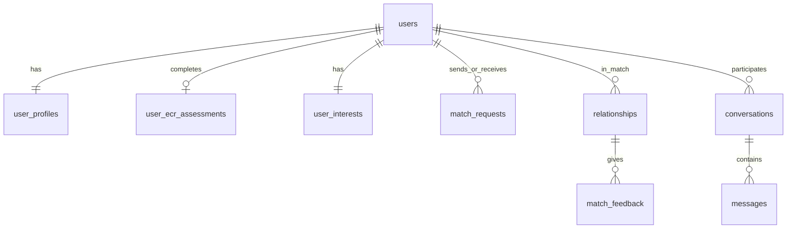

# Database architecture — MatchMind (MAD project)

This document describes **data domains**, **current on-device storage**, and a **target model** for a remote database and sync layer. The app is a dating / matching product that uses **ECR-RS**-style attachment inputs, **multi-category interest vectors** aligned with the training CSV, and **ML-based matching** (see `Model/`).

Design goals:

- **Local storage** for offline-first UX, fast reads, and queued writes when the network is poor.
- **Server database** as the source of truth for accounts, matches, and chat once users are authenticated.
- **Stable field names** so Android clients, CSV-derived models, and APIs stay aligned.

---

## Remote database: Supabase (chosen stack)

The project uses **[Supabase](https://supabase.com)** as the managed **PostgreSQL** backend.

| Piece | Role |
|-------|------|
| **Postgres** | Tables for profiles, ECR, interests, matches, messages (see §3). |
| **PostgREST** | HTTP API at `/rest/v1/` — used from Android via **OkHttp** (`com.mad.cw.supabase.SupabaseRestClient`). |
| **Auth (GoTrue)** | Sign-up / sign-in; JWT for `Authorization: Bearer …` on API calls. |
| **RLS** | **Required.** The **anon key** is embedded in the app (`BuildConfig`); security comes from **Row Level Security**, not from hiding the key. |
| **Realtime** | Optional for live chat. |

**Secrets:** Only **`supabase.anon.key`** is in the client (via `local.properties` → `BuildConfig`). Never ship **service_role** or the database password in the APK.

Setup steps: **`SUPABASE_SETUP.md`**. Starter SQL: **`sql/supabase_initial_schema.sql`**.

---

## 1. High-level data domains

| Domain | Purpose |
|--------|---------|
| **Identity & account** | User id, auth credentials, session tokens. |
| **Profile** | Display name, email, DOB, bio, demographics used in UI and matching. |
| **Psychometrics (ECR-RS)** | Raw Likert answers and derived scores (anxiety, avoidance) for ML features. |
| **Interests & lifestyle** | Eleven category columns + location/occupation, same semantics as `Model/updated_data.csv`. |
| **Matching** | Candidate pairs, scores, status (liked, passed, matched). |
| **Messaging** | Conversations and messages between matched users. |
| **AI Coach** | Optional history of prompts/replies for the in-app coach (can stay local-only or sync). |

---

## 2. Current local storage (Android — as implemented today)

The app uses **multiple `SharedPreferences` files** (key–value). This is suitable for prototyping; migrating to **Room** and/or **DataStore** is recommended before scaling.

### 2.1 `user_profile` (`ProfilePreferences`)

| Key | Type | Description |
|-----|------|-------------|
| `display_name` | string | Shown name |
| `email` | string | Contact email |
| `dob` | string | Date of birth (display format) |
| `bio` | string | Free-text “about” |
| `location` | string | City/area (may duplicate lifestyle screen) |
| `occupation` | string | Job title (may duplicate lifestyle screen) |

**Note:** Registration flow is not yet writing into this file; profile edit screen saves here.

### 2.2 `assessment` (`AssessmentPreferences`)

| Key | Type | Description |
|-----|------|-------------|
| `ecr_complete` | boolean | User finished the in-app questionnaire |
| `ecr_answers_csv` | string | Nine integers `q1,…,q9` (Likert 1–7), comma-separated |

Server-side you will typically compute **anxiety** and **avoidance** (and any subscale) from these nine items using the same rules as research / your notebook.

### 2.3 `user_interests` (`UserInterestStore`)

| Key | Type | Description |
|-----|------|-------------|
| `location` | string | Selected district/area |
| `occupation` | string | Selected occupation bucket |
| `Lifestyle` | string (JSON array) | e.g. `["Vegan","Yoga"]` |
| `Arts & Creativity` | string (JSON array) | Same pattern |
| `Music` | string (JSON array) | |
| `Movies & Shows` | string (JSON array) | |
| `Intellectual & Learning` | string (JSON array) | |
| `Food & Drinks` | string (JSON array) | |
| `Sports & Outdoor` | string (JSON array) | |
| `Gaming & Digital` | string (JSON array) | |
| `Travel & Culture` | string (JSON array) | |
| `Personality & Values` | string (JSON array) | |
| `Relationship Intent` | string (JSON array) | Usually one entry; stored as single-element array for consistency |

Column **names and JSON-array encoding** match **`Model/updated_data.csv`** so features can be built like the training pipeline.

### 2.4 Ephemeral / not persisted on disk

| Data | Where it lives |
|------|----------------|
| **AI Coach messages** | `AiCoachViewModel` + `AiCoachRepository` (memory, activity-scoped). Lost when the process dies. |
| **Inbox / match chat (UI demo)** | In-memory lists in fragments. |

These should gain **local persistence** (and optional sync) when you harden the product.

---

## 3. Target logical schema (server database)

Below is a **normalized** relational shape for **Supabase Postgres**. Adjust types (UUID vs BIGINT) if you fork the stack.

### 3.1 Core entities

**`users`**

- `id` — PK  
- `email` — unique, indexed  
- `password_hash` / `oauth_provider_id` — per auth strategy  
- `created_at`, `updated_at`  
- `last_login_at` — optional  

**`user_profiles`**

- `user_id` — PK, FK → `users.id`  
- `display_name`, `date_of_birth`, `bio`  
- `gender`, `target_gender` — if you use them for matching (present in CSV)  
- `photo_url` / `avatar_id` — optional  
- `updated_at`  

**`user_ecr_assessments`**

- `id` — PK  
- `user_id` — FK → `users.id`  
- `completed_at`  
- `raw_answers` — JSON array of 9 integers, or nine columns `q1…q9`  
- `anxiety_score`, `avoidance_score` — floats, computed server-side  
- `schema_version` — if scoring rules change  

**`user_interests`** (one row per user; wide columns or JSON)

Option A — **columns mirroring CSV** (simple for ML export):

- `user_id` — PK, FK  
- `lifestyle_json`, `arts_creativity_json`, … — `TEXT`/`JSON` holding string arrays  

Option B — **normalized tags**:

- `user_id`, `category`, `tag` — composite uniqueness `(user_id, category, tag)`  

Option B is better for analytics; Option A matches the CSV one-to-one and is faster to dump to Parquet for batch jobs.

**`match_requests`** (MatchMind: request / accept / decline — not Tinder-style swipes)

- `id` — PK  
- `from_user_id`, `to_user_id`  
- `status` — `pending` | `accepted` | `declined` | `cancelled_by_sender`  
- `suggestion_batch_id` — optional FK to ML batch  
- `ml_rank` — optional 1–5  
- At most **one** `pending` outbound request per sender (partial unique index)  

**`match_suggestion_batches`** (optional audit / RL features)

- `seeker_id`, `candidate_user_ids` (array, max 5), `model_scores`, `model_version`  

**`relationships`**

- Created when a request is **accepted** (via RPC); `feedback_due_at` = `started_at` + 3 days  
- `status` — `active` | `feedback_complete` | `ended`  

**`match_feedback`**

- One row per participant per relationship; `rating`, `comment`, optional `reward_signal` for RL  

**`profiles.current_status`**

- `looking_for_partner` — eligible for ML recommendations  
- `dating` — matched; `active_partner_id` set  
- `found_love` — off the market for recommendations  

**`conversations`**

- `id` — PK  
- `user_a_id`, `user_b_id` — enforce ordering rule (e.g. `user_a_id < user_b_id`) for uniqueness  
- `created_at`, `last_message_at`  

**`messages`**

- `id` — PK  
- `conversation_id` — FK  
- `sender_id` — FK → `users.id`  
- `body` — text  
- `created_at`  
- `client_message_id` — optional UUID for idempotent mobile sync  

### 3.2 AI Coach (optional on server)

**`ai_coach_threads`** / **`ai_coach_messages`**

- Tie to `user_id`; store role (`user` / `assistant`), content, timestamps.  
- Or keep coach history **only on device** if privacy / cost is a concern.

---

## 4. Entity relationship (overview)

---

## 5. Local storage strategy (recommended next step)

Keep **SharedPreferences** only for small flags (e.g. “onboarding done”) or migrate fully to **DataStore Preferences**.

For structured data, prefer:

| Layer | Technology | Holds |
|-------|------------|--------|
| **Structured local DB** | **Room** (SQLite) | Profile snapshot, ECR answers + computed scores cache, interest JSON per category, conversation/message queue, sync state (`last_synced_at`, pending outbox). |
| **Preferences** | **DataStore** | Auth tokens (or use encrypted storage), feature flags, lightweight settings. |
| **Secrets** | **EncryptedFile** / Keystore | Refresh tokens, API keys if embedded. |

### 5.1 Sync pattern (typical)

1. **Read path:** UI reads from Room first (instant), then triggers background sync.  
2. **Write path:** UI writes to Room and enqueues an **outbox** row (`pending_sync` table or WorkManager job).  
3. **Conflict handling:** Last-write-wins with `updated_at`, or server wins for sensitive fields — document the rule per table.

### 5.2 Mapping current prefs → Room tables

| Current pref file | Suggested Room table(s) |
|-------------------|-------------------------|
| `user_profile` | `LocalUserProfile` |
| `assessment` | `LocalEcrAssessment` |
| `user_interests` | `LocalUserInterests` (one row with JSON columns or child rows per tag) |

After migration, `ProfileFragment` / `Questionnaire` / `LifestyleFragment` should read/write Room (or a repository that abstracts Room + API).

---

## 6. Alignment with ML / CSV

- **ECR:** Server (or device) computes **anxiety** / **avoidance** from the nine Likert items; store both **raw** and **derived** for reproducibility.  
- **Interests:** Store the same **category names** and **tag strings** as `InterestTaxonomy` / `updated_data.csv` so feature extraction matches training.  
- **Versioning:** Add `interest_taxonomy_version` or `app_schema_version` if tags evolve.

---

## 7. Security and privacy (checklist)

- Encrypt sensitive columns at rest on the server where required by policy.  
- Do not log raw questionnaires or messages in production without consent.  
- On device: avoid storing refresh tokens in plain SharedPreferences; use encrypted storage for production builds.

---

## 8. Summary

| Layer | Today | Direction |
|-------|--------|-----------|
| **Device** | Three `SharedPreferences` files + in-memory chat | **Room + DataStore**, optional encrypted tokens |
| **Server** | Not fully wired | **Supabase Postgres** + PostgREST; RLS + Auth; tables per §3 / `sql/supabase_initial_schema.sql` |
| **ML** | CSV training only | **Same feature columns** as CSV for online scoring; store raw + derived scores |

This file is the baseline for backend API design and the next migration of the Android data layer.
